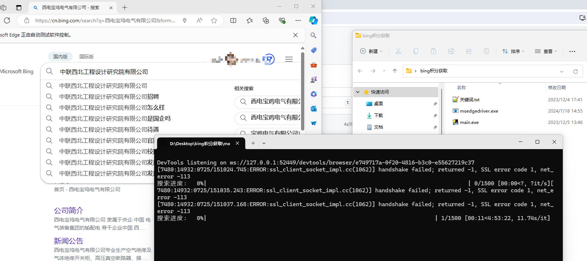

# BingPointsAuto
利用edge浏览器自动获取bing搜索引擎积分

# 步骤

前提：需要在edge浏览器中登陆bing的账号

## 1. 先找到本地环境Edge浏览器版本号对应的 msedgedriver
msedgedriver [下载地址](https://developer.microsoft.com/en-us/microsoft-edge/tools/webdriver/?form=MA13LH#downloads)

## 2. 将解压后的 msedgedriver 放入main.exe 目录中，双击点击运行即可

# 如图

